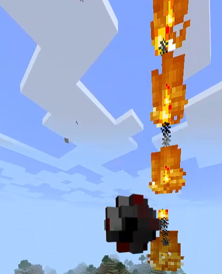
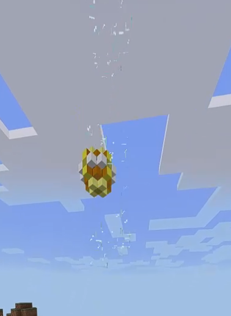
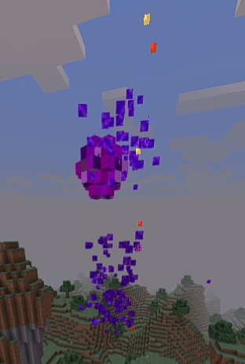

# CustomSnowballs
A plugin that adds "custom" snowballs (PocketMine 4.0.0)

# How does it work?
The plugin adds snowballs with modified effects and models (such as a snowball that lights you on fire or causes lightning to strike you).
These CustomSnowballs are obtained from the plugin store (/snowballs or /cs), using <a href="https://poggit.pmmp.io/p/economyapi">EconomyAPI</a> and <a href="https://github.com/jojoe77777/FormAPI">FormAPI</a> as dependencies. You can also edit the plugin language using any <a href="resources/config.yml#L2">available language</a>, or add your <a href="resources/lang">own language</a>.

# Examples

  
  
  

# Note
I made this plugin for fun, so if you want to modify the snowballs or add some others you will have to edit the source code directly.
